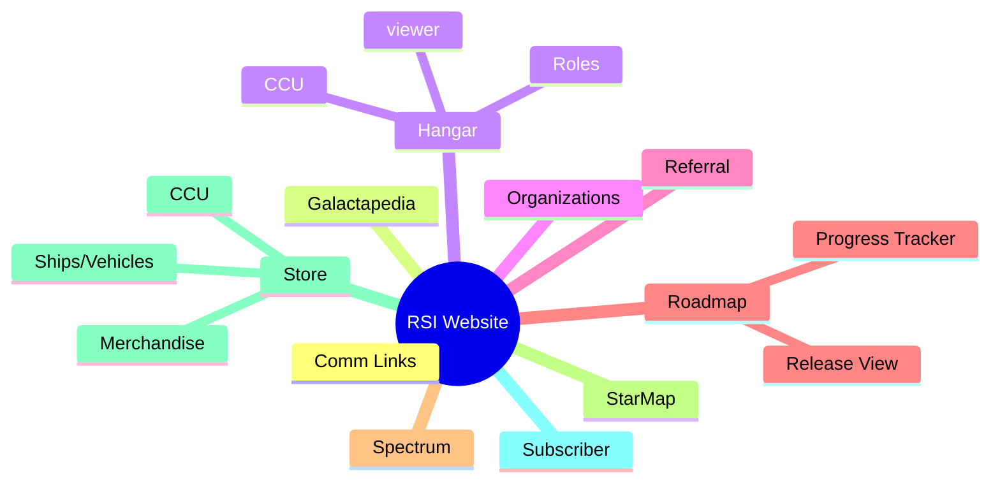

# Quick Start

## So, you want to make an app for Star Citizen?

Before you get started here is some handy research to have in mind about what the rest of the community is doing, you might just save yourself a few headaches reading it for a couple minutes.

### Best Practices

* [ ] Have a public website!
* [ ] Have a privacy policy!
* [ ] Have an about page showing authors!
* [ ] Have a public repository!
* [ ] Have a [project license](#user-content-fn-1)[^1]!
* [ ] Have documentation pages!
* [ ] Have a Discord for your app community!
* [ ] Have a financial support platform for sponsors!
* [ ] Make your app an installable PWA[^2]!
* [ ] Have an API for your app!
* [ ] Use and contribute to Star Citizen Draft Specifications!

<table data-view="cards" data-full-width="false"><thead><tr><th></th><th></th><th></th><th data-hidden data-card-cover data-type="files"></th><th data-hidden data-card-target data-type="content-ref"></th></tr></thead><tbody><tr><td><h3>Repositories</h3></td><td><ul><li>GitHub</li><li>GitLab</li><li>Bitbucket</li></ul></td><td></td><td><a href="../../.gitbook/assets/pexels-adrien-olichon-3137064.jpg">pexels-adrien-olichon-3137064.jpg</a></td><td><a href="repositories.md">repositories.md</a></td></tr><tr><td><h3>Licenses</h3><ul><li>MIT</li><li>GPL 2.0</li><li>GPL 3.0</li><li>CC BY 4.0</li></ul></td><td></td><td></td><td><a href="../../.gitbook/assets/pexels-sora-shimazaki-5669602.jpg">pexels-sora-shimazaki-5669602.jpg</a></td><td><a href="licenses.md">licenses.md</a></td></tr><tr><td><h3>Languages</h3></td><td><ul><li>JavaScript</li><li>Python</li><li>C#</li><li>Ruby</li></ul></td><td></td><td><a href="../../.gitbook/assets/pexels-pixabay-270404.jpg">pexels-pixabay-270404.jpg</a></td><td><a href="languages.md">languages.md</a></td></tr><tr><td></td><td><strong>Website TLDs</strong></td><td><ul><li>.<a data-footnote-ref href="#user-content-fn-3">tools</a></li><li>.<a data-footnote-ref href="#user-content-fn-4">space</a></li><li>.<a data-footnote-ref href="#user-content-fn-5">games</a></li><li>.<a data-footnote-ref href="#user-content-fn-6">app</a></li><li>.<a data-footnote-ref href="#user-content-fn-7">net</a></li></ul></td><td><a href="../../.gitbook/assets/pexels-adrien-olichon-3137068 (Small).jpg">pexels-adrien-olichon-3137068 (Small).jpg</a></td><td><a href="website-tlds.md">website-tlds.md</a></td></tr></tbody></table>

### Focus Areas of RSI Website for Community Apps

[^1]: Why not MIT or GPL-3.0 to promote open collaboration?

[^2]: Progressive Web Application

[^3]: \~$20 USD/yr

[^4]: \~$20 USD/yr

[^5]: \~$20 USD/yr

[^6]: \~$16 USD/yr

[^7]: \~$18 USD/yr
