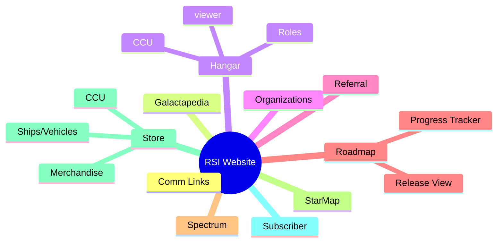

# Research

## So, you want to make an app or mod for Star Citizen?

Before you get started here is some handy research to have in mind about what the rest of the community is doing, you might just save yourself a few headaches reading it for a minute.

## Most Common

<table data-view="cards"><thead><tr><th></th><th></th><th></th><th data-hidden data-card-cover data-type="files"></th></tr></thead><tbody><tr><td><h3>Repositories</h3></td><td><ul><li>GitHub</li><li>GitLab</li><li>Bitbucket</li></ul></td><td></td><td><a href="../../.gitbook/assets/pexels-adrien-olichon-3137064.jpg">pexels-adrien-olichon-3137064.jpg</a></td></tr><tr><td><h3>Licenses</h3><ul><li>MIT</li><li>GPL 2.0</li><li>GPL 3.0</li><li>CC BY 4.0</li></ul></td><td></td><td></td><td><a href="../../.gitbook/assets/pexels-sora-shimazaki-5669602.jpg">pexels-sora-shimazaki-5669602.jpg</a></td></tr><tr><td><h3>Languages</h3></td><td><ul><li>JavaScript</li><li>Python</li><li>C#</li><li>Ruby</li></ul></td><td></td><td><a href="../../.gitbook/assets/pexels-pixabay-270404.jpg">pexels-pixabay-270404.jpg</a></td></tr></tbody></table>

### Focus Areas of RSI Website for Community Apps

